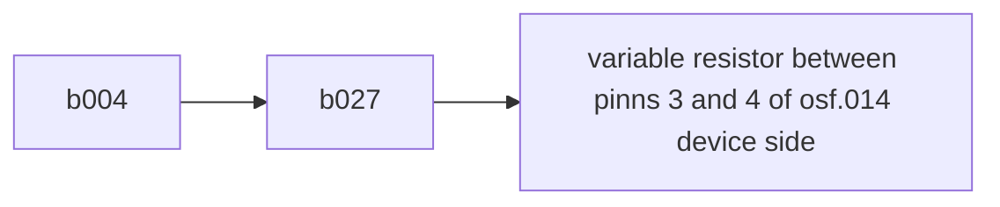

# initialization test
## setup
Connected 

## results
initialization works on a standard PoE switch.

# current test
## setup
Connected

Varied the output inpedence to simulate different loads. Monitored the temperature of the controller and mosfet chips with a thermal camera.
## results
Output stable up to 25 watts (which was the limmit of the test system). Temperature of the mosfet rose by 8°C. This would suggest stable operation well above the test szenario. 
